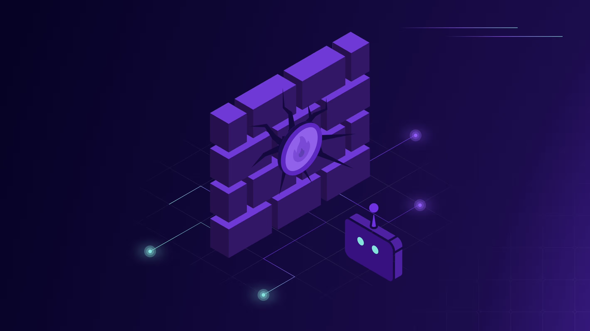

# Agent Security & Observability Framework

**Holistic framework for Agent Security and Observability making trustworthy Agents achievable.**

## Rational
Agents must become trustworthy to enable widescale adoption.

Transparency is the foundation of trust. Whether built in-house or adopted as part of a service. Consumed on cloud, as SaaS, on-prem or on endpoints. Agents must be fully observable by the enterprise that welcomes them in. We cannot trust a magic black-box.

For agents to become trustworthy they must be **inspectable, auditable and instrumentable**.

- **Inspectable:** we don’t have to guess what’s inside. Which tools, models and capabilities are being used. What software version is running and who built it. What are the services behind them, and which data they can access. Must dynamicly adapt to account for rapid changes in agent components.
- **Auditable:** we know what the agent did and why. We can trace back any action taken to the reasoning behind it and the originating task. Even if the thread goes through multiple agents and software systems. In case of compromise, we can identify and remediate the root cause.
- **Instrumentable:** we can hook into agent execution and steer it in the right direction. We can put hard controls around agents and define their scope of action. Apply centralized enterprise logic, be it security, compliance or legal, uniformly across agent platforms. Prevent or modify behavior to comply.

### Key Components

The framework covers the following aspects
1. Agent Security & Observability Protocol (ASOP) that defines the interaction between the Observed Agent and the Guardian Agent
2. Observability requirements and implementations for tracing all ASOP events using OpenTelemetry and OCSF
3. Agent BOM (AgBOM) requirements and implementations for exposing dynamic Agent's bill-of-material via CoycloneDX, SWID and SPDX

## Getting Started

- 📚 **Explore the Documentation:** Visit the [Documentation Site](https://improved-adventure-3jj129k.pages.github.io/) for a complete overview, the full protocol specification, tutorials, and guides.
- 📝 **View the Specification:** [Specification](https://github.com/zenitysec/AOS/tree/main/specification)

## Contributing

We welcome community contributions to enhance and evolve the AOS protocol!

- **Questions & Discussions:** Join our [GitHub Discussions](do we have github enterprise?).
- **Issues & Feedback:** Report issues or suggest improvements via [GitHub Issues](https://github.com/zenitysec/AOS/issues).
- **Contribution Guide:** See our [CONTRIBUTING.md](CONTRIBUTING.md) for details on how to contribute.

## What's next

#### v0.1 (Public Preview)
- Overall documentation and requirements
- ASOP protocol definitions and schema
- Observability definitions for for OpenTelemetry and OCSF
- AgBOM requirements

#### v1
- Implementation of Agent instrumentation
- Implementation of Guardian Agent sample app with
  - ASOP protocol Support
  - ASOP to OpenTelemetry mapper
  - ASOP to OCSF mapper
- FastMCP client instrumentation for ASOP
- A2A client instrumentation for ASOP

#### v2
- Requirements for CycloneDX, SPDX, SWID
- Implementation of ASOP to AgBOM mappers for CycloneDX, SPDX, SWID

#### v3
- Extending A2A and MCP to support deny and modify operations
- Implementation of Agent with deny and modify support

## About

The AOS Protocol is an open-source project by Zenity, under the [Apache License 2.0](LICENSE), and is open to contributions from the community.
