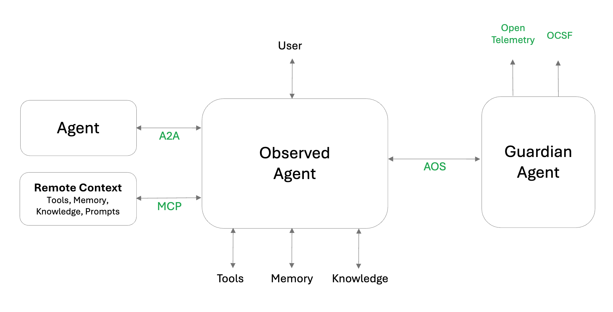

# Core concepts

## Agent Environment Overview
An agent operates within an environment that includes interactions with several key entities and system components:
- User: The agent interfaces directly with the user
- Other Agents: Communication with peer agents is handled via the A2A protocol, enabling collaboration or delegation.
- Memory: The agent accesses memory resources that may be either local or remote through MCP.
- Knowledge Base: Knowledge sources can be either locally or accessed remotely via MCP
- Tools: Function or tool calling are either locally or invoked remotely using the MCP

A trustworthy agent is an Observed Agent that transparently exposes its interactions with the environment through standardized APIs to a Guardian Agent

## Agent Instrumentation

### Observed Agent Responsibilities:
An Observed Agent should ensure inspectability, traceability, and observability by:
- Emitting Standard Events: Every interaction with the environment must be exposed through standardized event formats.
- Standardized Tracing: Maintain a standardized trace of all interactions to support improved observability, enable a holistic multi-agent view, and facilitate historical interaction analysis.
- Instrumentation: Events should trigger hooks that allow the Guardian Agent to enforce policies. Example policies may include restricting external communication, redacting sensitive data, or enforcing compliance constraints. Based on these policies, the Guardian Agent can permit, deny, or modify the content of the interaction.
- Reactive Capabilities: The agent must be capable of responding to Guardian Agent directives, including action denials or content mutations.

### Guardian Agent Responsibilities:
The Guardian Agent enforces policies and enables tracing through the following:
- Event Instrumentation Utilization: Leverage standard event hooks to evaluate and enforce policies, responding with permit, deny, or mutate instructions.
- Standardized Tracing: Maintain a consistent trace of all interactions to enhance observability, support a comprehensive view across agents, and enable detailed analysis of interaction history.
- Provide dynamic AgBOM: Maintain and notify an up to date list of components and dependencies for the agent environment changes such as new or updated tools, models and other components

## ASOP Protocol and Events

The interaction between the Observed Agent and the Guardian Agent ASOP APIs follows the Agent-to-Agent (A2A) protocol structure by design. 
Therefore, our implementation should align with A2A methods and parameters wherever possible. All agent-to-agent and user-to-agent communications will be directly mapped from the A2A protocol to ASOP.
However, we need to extend ASOP to abstractly support memory, knowledge, and tool invocation. This extension should accommodate both local and remote access via the MCP.

We provide here an initial list of Events for better understanding of ASOP scope and approach.
Basically, Events aim to cover all interactions with the surrounding entities (User, Other Agents, Tools, Memory, Knowledge) 
as well as capturing all A2A and MCP protocol messages.

### Agent to Agent and User to Agent Events

The following Events are based on A2A protocol
- tasks/send
  Send a new task to another agent (or User-Agent task)
- tasks/sendSubscribe
  Send a new task to another agent requiring streaming updates
- tasks/get
  Retrieve the state or result of a specific task
- tasks/cancel
  Cancel a running or pending task
- agent/discovery
  Discover an agent
We propose to add the following for robustness
- agent/ping
  Ping an agent for continuity check

### Agent to Knowledge, Memory and Tools Events

The following Events are used to capture interactions with Knowledge, Memory and Tools
either locally or remotely via MCP.
These are "steps" events since they provide "white-box" visibility into each Agent actions.
- steps/knowledgeRetrieval
  Knowledge retrieval, locally or remotely via MCP
- steps/knowledgeStore
  Knowledge store, locally or remotely via MCP
- steps/memoryRetrieval
  Memory retrieval, locally or remotely via MCP
- steps/memoryStore
  Memory store, locally or remotely via MCP
- steps/toolCall
  Tool call, locally or remotely via MCP
- steps/promptsList
  List available prompts, locally or remotely via MCP
- steps/toolList
  List available tools (local or remote)

## Read Next

- [Implementation](./topics/implementation.md)
- [MCP & A2A](./topics/mcp_a2a.md)
