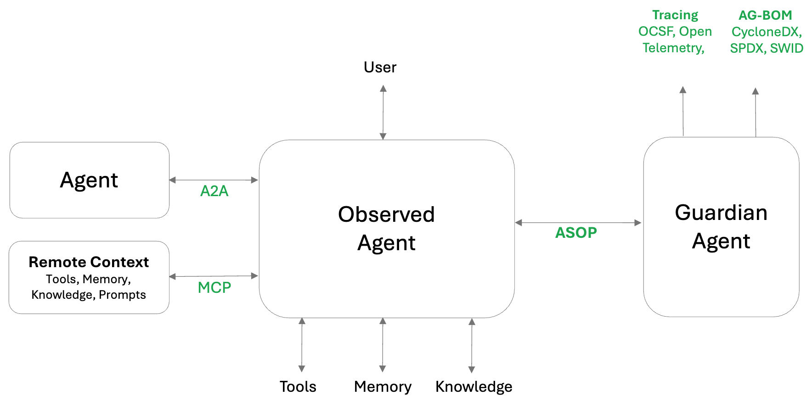

# Core concepts

AOS specifies the in-line _Hooks_ and out-of-band _Events_ that an agent need to support to be considered trustworthy.
Usings these events and hooks, _Observed Agents_ can be monitored and protected by a _Guardian Agent_.

## Agent Observability Standard

To support an holistic view and security enforcement, the framework defines three components

1. **Instrument** - Observed agents provide standard hooks that can modify runtime execution via lightweight callouts
2. **Trace** - Observed agents emit comprehensive events on every runtime decision and lifecycle change
3. **Inspect** - Observed agents support requests for Agent Bill-Of-Material (AgBOM)

## Agent Environment Overview

An agent operates within an environment that includes interactions with several key entities and system components:

| Components | Description | Can be Local | Can be Remote | Related Protocols |
|--|--|--|--|--|
| User | Interface with the user, either directly or indirectly | ✗ | ✓ | |
| Other Agents | Communication and collaboration with peer agents | ✓ | ✓ | |
| Memory | Access short-term or long-ter, memory resources | ✓ | ✓ | A2A |
| Knowledge | Files, resources, RAG, and other sources | ✓ | ✓ | MCP |
| Prompts | Saved prompts used by the agent as templates for sub-tasks | ✓ | ✗ | MCP |
| API Tools | Tool calls that operate over REST API calls | ✓ | ✓ | MCP |
| OS Tools | Tool calls that operate via Operating System calls or direct keyboard and mouse manipulation (CUA agents) | ✓ | ✗ | |
| LLM | Direct access to LLMs either for sub-tasks or reasoning | ✓ | ✓ | |

A trustworthy agent is an Observed Agent that transparently exposes its interactions with the environment through standardized APIs to a Guardian Agent

## Agent Instrumentation

### Observed Agent Responsibilities

An **Observed Agent** is responsible for ensuring environmental visibility and policy responsiveness through the following capabilities:

- **Support BOM Requests**  
  Provide up-to-date information about components and dependencies relevant to the agent’s operational context.
- **Emit Events**  
  Generate standardized events that reflect all interactions with the environment to ensure traceability and observability.
- **Support Hooks**  
  Integrate with lifecycle hooks that allow external entities (e.g., Guardian Agent) to inspect or control operations.
- **Comply with Hook Responses**  
  React appropriately to directives from hooks, such as permitting, denying, or modifying actions based on policy enforcement.

---

### Guardian Agent Responsibilities

The **Guardian Agent** enhances control, compliance, and dynamic environment awareness via the following responsibilities:

- **Observe and Emit Events in Multiple Standards**  
  Capture and emit observed interactions using various standardized formats to support interoperability and broader system integration.
- **Subscribe to Hooks**  
  Register for and listen to hooks emitted by Observed Agents to enable active intervention in agent behavior.
- **Apply Policy**  
  Enforce operational policies by evaluating hook-triggered events and issuing corresponding decisions (permit, deny, modify).
- **Dynamically Maintain AgBOM**  
  Monitor agent lifecycle events to update and maintain the Agent BOM (Bill of Materials) in real-time, reflecting current tools, models, and components.

## A2A and MCP

AOS works even better when MCP and A2A are part of an Agent's environment.
It carries MCP and A2A intact, ensuring full compatibility and transparency.

AOS also proposes security extensions for [MCP](../spec/instrument/extend_mcp.md) and [A2A](../spec/instrument/extend_a2a.md) for native observability support.

## Read Next

- [AOS in Action](./AOS_in_action_example.md)
