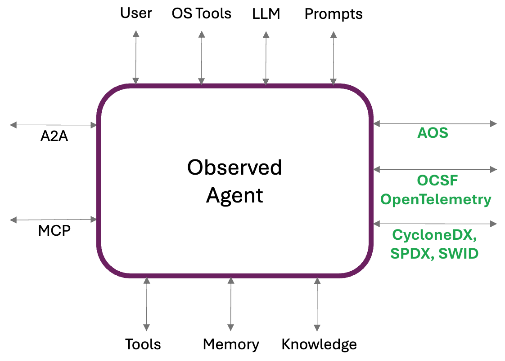

# Core concepts

AOS specifies the in-line _Hooks_ and out-of-band _Events_ that an agent need to support to be considered trustworthy.
Usings these events and hooks, _Observed Agents_ can be monitored and protected by a _Guardian Agent_.

## Agent Environment Overview

An agent operates within an environment that includes interactions with several key entities and system components:

| Components | Description | Can be Local | Can be Remote | Related Protocols |
|--|--|--|--|--|
| User | Interface with the user, either directly or indirectly | ✗ | ✓ | |
| Other Agents | Communication and collaboration with peer agents | ✓ | ✓ | |
| Memory | Access short-term or long-ter, memory resources | ✓ | ✓ | A2A |
| Knowledge | Files, resources, RAG, and other sources | ✓ | ✓ | MCP |
| Prompts | Saved prompts used by the agent as templates for sub-tasks | ✓ | ✗ | MCP |
| API Tools | Tool calls that operate over REST API calls | ✓ | ✓ | MCP |
| OS Tools | Tool calls that operate via Operating System calls or direct keyboard and mouse manipulation (CUA agents) | ✓ | ✗ | |
| LLM | Direct access to LLMs either for sub-tasks or reasoning | ✓ | ✓ | |

A trustworthy agent is an Observed Agent that transparently exposes its interactions with the environment through standardized APIs to a Guardian Agent

## Agent Instrumentation

### Observed Agent Responsibilities:
An Observed Agent should ensure inspectability, traceability, and observability by:

- Emitting Standard Events: Every interaction with the environment must be exposed through standardized event formats.
- Standardized Tracing: Maintain a standardized trace of all interactions to support improved observability, enable a holistic multi-agent view, and facilitate historical interaction analysis.
- Instrumentation: Events should trigger hooks that allow the Guardian Agent to enforce policies. Example policies may include restricting external communication, redacting sensitive data, or enforcing compliance constraints. Based on these policies, the Guardian Agent can permit, deny, or modify the content of the interaction.
- Reactive Capabilities: The agent must be capable of responding to Guardian Agent directives, including action denials or content mutations.

### Guardian Agent Responsibilities:
The Guardian Agent enforces policies and enables tracing through the following:

- Event Instrumentation Utilization: Leverage standard event hooks to evaluate and enforce policies, responding with permit, deny, or modify instructions.
- Standardized Tracing: Maintain a consistent trace of all interactions to enhance observability, support a comprehensive view across agents, and enable detailed analysis of interaction history.
- Provide comprehensive and dynamic AgBOM: Maintain and notify an up to date list of components and dependencies for the agent environment changes such as new or updated tools, models and other components

## Agent Security & Observability Framework

To support an holistic view and security enforcement, the framework defines three components

1. AOS defines the interaction between the Observed Agent and the Guardian Agent
2. Observability requirements and implementations for tracing all AOS events
3. Agent BOM (AgBOM) requirements and implementations for exposing dynamic Agent's bill-of-material

## A2A and MCP

Our framework assumes MCP and A2A are natural part of an Agent's environment.
The AOS carries MCP and A2A intact, ensuring full compatability and transparency.

Security extensions proposed for those protocols will be coordinated with A2A and MCP groups.
For further details on the required extensions read [Security Extensions](./docs/topics/security_extensions/README.md)

## Read Next

- [AOS in Action](./topics/AOS_in_action.md)
